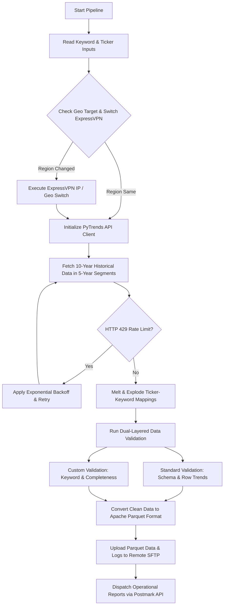

# 📈 Google Trends Automated Ingestion & Validation Pipeline

[](https://www.python.org/)
[](https://pandas.pydata.org/)
[](https://parquet.apache.org/)
[](#)

An enterprise-grade data automation pipeline designed to extract 10-year historical Google Trends search frequency data across international markets (US, UK, Worldwide). Built with intelligent anti-rate-limiting strategies, ExpressVPN region switching, dual validation engines, and automated Parquet storage delivery via SFTP.

---

## 🏗️ Architecture & Pipeline Flow



## 🛠️ Key Engineering Capabilities
- ⏳ 10-Year Historical Ingestion Window: Seamlessly stitches two 5-year trend queries together into a single continuous time-series dataset without overlapping duplicates.  
- 🌐 Geo-Targeted ExpressVPN Auto-Switching: Automatically detects regional targets (e.g., US vs. UK/GB) and executes shell commands to switch VPN proxy locations dynamically.  
- 🛑 Rate-Limit Resilience (HTTP 429): Integrates adaptive backoff delays and exponential retries to overcome Google Trends rate-limiting constraints cleanly.  
- 🔍 Dual-Layered Data Quality Engine:
     - Standard Data Validator: Verifies schema structure, row count percentage deviations against previous runs, missing values, and date ranges.  
     - Custom Data Validator: Ensures keyword-ticker exploding consistency and verifies strict column presence.  
- 📦 High-Performance Storage (Parquet): Automatically compresses outputs into fast, efficient Apache Parquet files for enterprise data lake ingestion.  
- 🚀 SFTP Delivery & Alert System: Features robust SFTP upload retries with progress tracking and operational status dispatch via Postmark API.

---
## 🛠️ Tech StackCore: 
- Python 3.9+  
- API & Scraping: PyTrends, Urllib3, ExpressVPN Linux CLI Integration  
- Data Engineering: Pandas, FastParquet, NumPy  
- Infrastructure & Delivery: Paramiko (SFTP), Postmarker API, Subprocess, Logging


## ⚙️ Configuration & Setup
### 1. Prerequisites
  - Python 3.9 or higher
  - ExpressVPN Linux CLI (if region auto-switching is enabled)[cite: 12]


### 2. Installation
Clone the repository and install dependencies:
```
git clone [https://github.com/nivethamanoharan/google-trends-etl-pipeline.git](https://github.com/nivethamanoharan/google-trends-etl-pipeline.git)
cd google-trends-etl-pipeline
pip install -r requirements.txt
```

### 3. Environment Setup
Create a .env file in your root folder:

```
SFTP_UPLOAD_HOST=sftp.example.com
SFTP_UPLOAD_USERNAME=your_username
SFTP_UPLOAD_PASSWORD=your_password
SFTP_UPLOAD_PORT=22
SFTP_UPLOAD_PATH=/remote/data/
SFTP_LOG_UPLOAD_PATH=/remote/logs/
SFTP_INPUT_DOWNLOAD_PATH=/remote/inputs/
SFTP_ERROR_FILE_UPLOAD_PATH=/remote/errors/
POSTMARK_API_TOKEN=your_postmark_api_key

```


### 4. Input Configuration
Create Inputs/keywords.csv:

```
keywords,country,ticker
Ethereum,US,ETH-USD
Bitcoin,UK,BTC-USD
Micro Ether,worldwide,MET

```

---

### 🚀 Running the Pipeline
Execute the primary pipeline script:

```
python Man_GoogleTrends_ex.py

```

---

### 📊 Output Schema (Table_1.parquet)
| Field Name | Type | Description | 
|------------|------|-------------|
| Date_Scraped | String | Execution date (YYYY-MM-DD) |  
| Date | Datetime | Trend observation timestamp |  
| Country | String | Geo target region (US, UK, worldwide) |  
| Ticker | String | Financial instrument ticker symbol | 
|Keyword | String | Target search query term | 
| Value | String / Numeric | Relative search interest index (0–100) | 

---

## 📧 Author & Connect
#### Nivetha Manoharan
> Software Developer (Data Engineering & Automation)
- 💼 LinkedIn: linkedin.com/in/nivethamanoharan  
- ✉️ Email: nivemanoharan2001@gmail.com  
- 📍 Status: Open to relocation to UAE | Immediate Availability 
